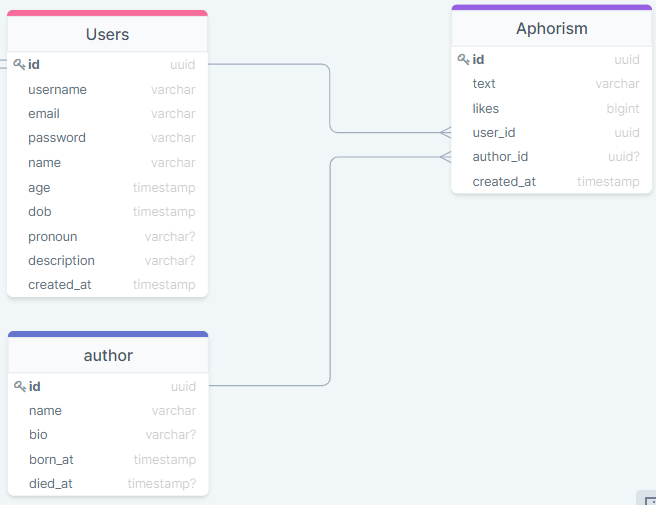

# Backend

This is the backend directory with all backend files.  
They are build with Express, Typescript and TypeORM.  

## Commands

```bash
    # starts server
    npm run dev

    # creates migration
    npm run typeorm-migration #insert migration name here

    # runs all migrations
    npm run typeorm-run 

    # reverts migration
    npm run typeorm-revert
```

## Database details


